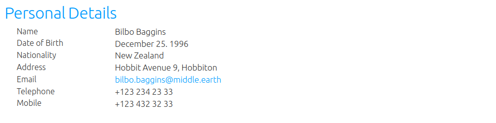
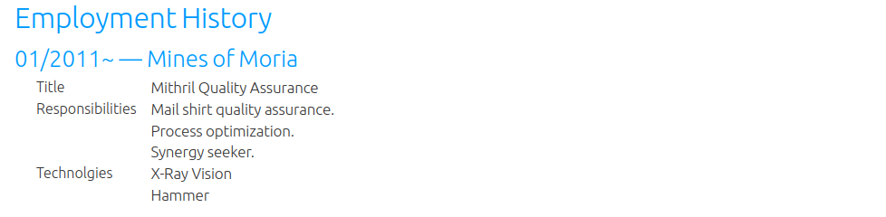

= asciidoctor html resume theme 
:author: Urs Roesch
:email: <github@bun.ch>
:notoc:
:noheader:
:nofooter:
ifndef:env-github[]
:icons: font
endif::env-github[]
ifdef::env-github[]
:tip-caption: :bulb:
:note-caption: :information_source:
:important-caption: :heavy_exclamation_mark:
:caution-caption: :fire:
:warning-caption: :warning:
endif::env-github[]

This is a theme for formating a structured document such as a resume or CV
(curriculum vitae). I used it to get a job and it obviously working as
I still have one :).

Currently there are a few very simple color schemes available namely:

* Red
* Orange
* Green
* Purple
* Dark Purple
* Light Blue

== How to write

There are two special rules for writing with this stylesheet. The first is to
list personal information in a concise way the second is for the employment 
history.

=== Personal details, eduction and skills sections

A description list is used with the modified `[horizontal]` style to render as a 
table. The sytle modification is to space out the first column with a fixed width 
to align the output among the sections.

==== Sample 

.Asciidoctor code
[source]
----
== Personal Details
[horizontal]
Name:: Bilbo Baggins
Date of Birth:: December 25. 1996
Nationality:: New Zealand
Address:: Hobbit Avenue 9, Hobbiton
Email:: bilbo.baggins@middle.earth
Telephone:: +123 234 23 33
Mobile:: +123 432 32 33
----

.Rendered result

=== Employment history section

The employment history section also uses description lists but requires
`role=expenrience` to be defined to render correctly. An unnumbered list
within the description list is rendered without bullets as the sample
below shows. 

.Asciidoctor code
[source]
----
== Employment History

=== 01/2011~ -- Mines of Moria
[horizontal,role="experience"]
Title:: Mithril Quality Assurance
Responsibilities::
* Mail shirt quality assurance.
* Process optimization.
* Synergy seeker.
Technolgies::
* X-Ray Vision
* Hammer 
----

.Rendered result

NOTE: This section is not yet complete, more samples to follow.

== How to use

=== Copy the css file
Simply copy one of the css files e.g the orange one `resume-orange.css` to 
your projects root folder and run `asciidoctor` as follows:

[source,shell]
----
asciidoctor -a stylesdir="$(pwd)" -a sytlesheet=resume-orange.css *.adoc
----

=== As a git submodule 

Add the style as git submodule into your project.

[source,shell]
----
git submodule add \
  https://github.com/uroesch/asciidoctor-resume-theme \
  resume
----

The run asciidoctor as shown below.

[source,shell]
----
asciidoctor \
  -a stylesdir="$(pwd)/resume" \
  -a sytlesheet=resume-orange.css \
  *.adoc
----

== Build from scratch

=== Prerequisites
* ruby
* rake
* docker

=== Build

Simply type rake and the command will download a docker container for the
build. And create the `resume-*.css` file. 

[source,shell]
----
rake
----
